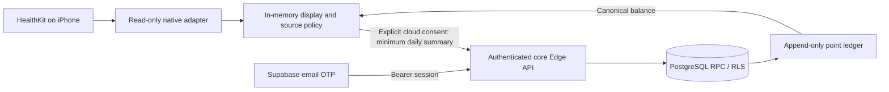

# Architecture — first core slice

A pnpm TypeScript workspace holds a native Expo development app, pure mission rules, a typed API client and a health-provider contract. Supabase supplies email OTP and PostgreSQL. A small read-only Swift Expo module reads HealthKit locally. No core wallet or blockchain dependency exists.

HealthKit records, source bundle identifiers, sleep intervals and heart-rate samples stay on-device. An opaque source pin is used only to enforce a chosen source within a day; it is not cryptographic evidence. All client summaries are untrusted. A modified app can fabricate input despite structural validation. No anti-fraud guarantee is claimed.

PostgreSQL owns identity checks, current consent, server time, business uniqueness, mission instances and point calculation. Claims serialize on account state; the award depends on accepted activity and pinned rules, never a requested amount. New rules cannot create another business entitlement for the same date. A ledger sum supplies canonical balance.

The intended admin application and isolated Web3 Lab have not been delivered in this first slice. The Lab must have separate identity, storage, environment and secrets; core imports are prohibited by the boundary check. Conditional P1/P2 features remain outside the implementation.
